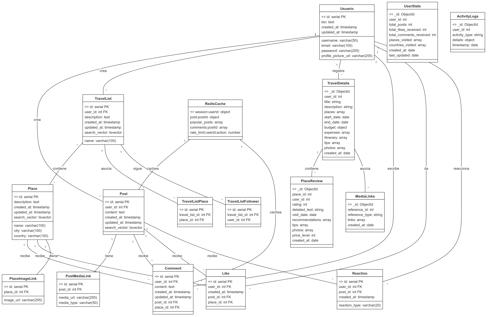
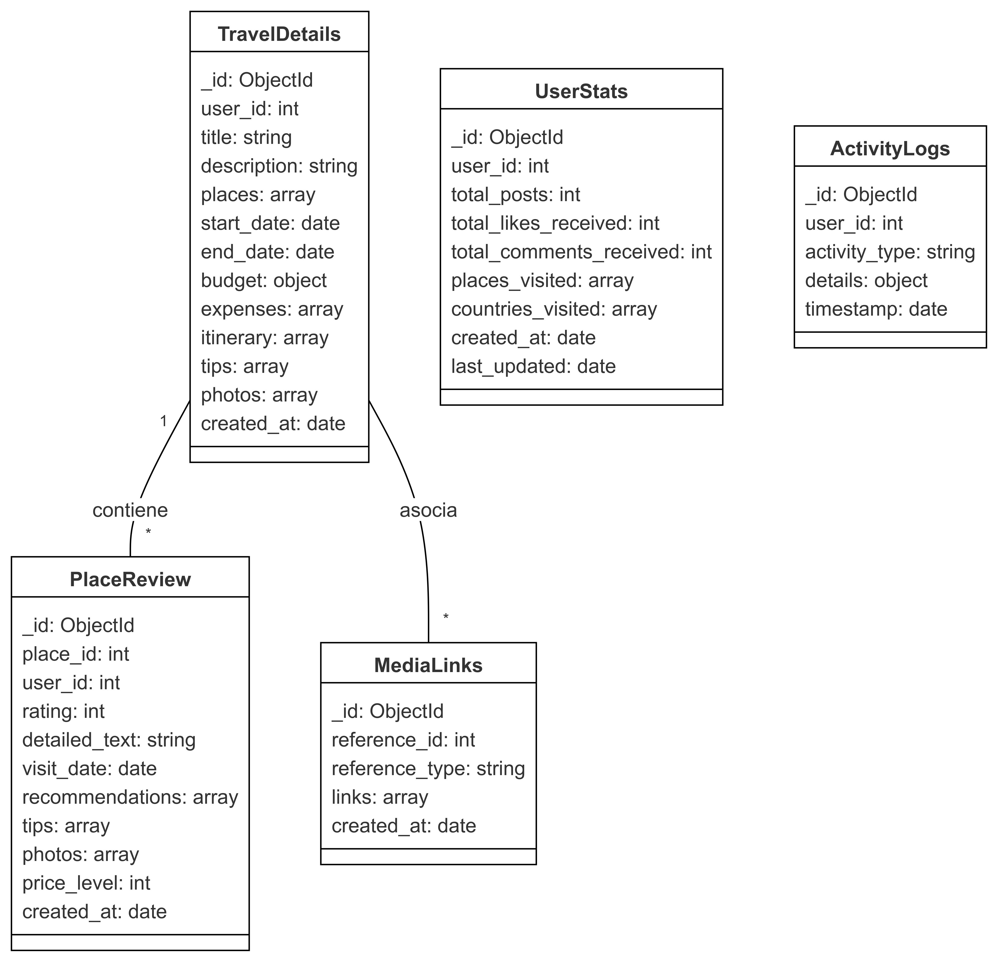
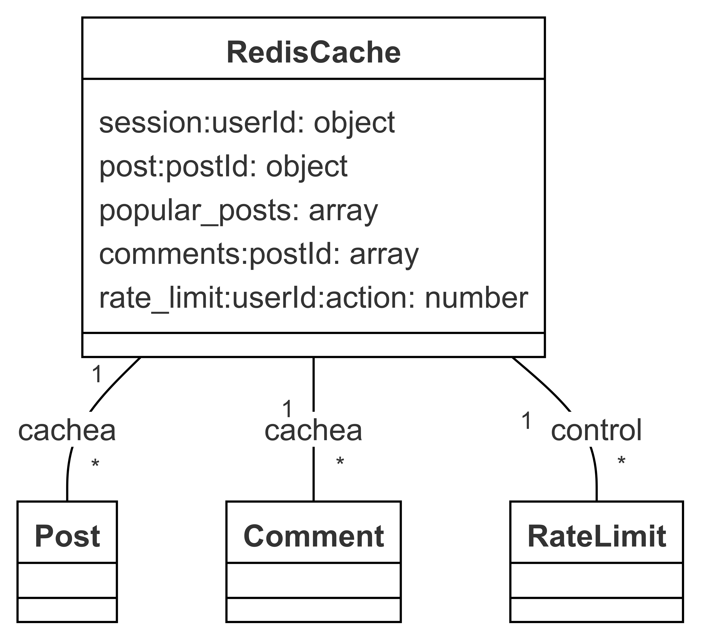

# Red Social de Viajes

Este proyecto es el backend de una red social orientada a compartir experiencias de viaje, utilizando Flask para la API, PostgreSQL, MongoDB y Redis como bases de datos, y desplegado mediante Docker.

## 1. Descripción General

El sistema permite a los usuarios realizar publicaciones sobre viajes, interactuar con otros mediante comentarios, likes, y gestionar listas de destinos turísticos. Todo el backend está contenido en Docker para facilitar el despliegue y replicación.

El proyecto se basa en tres tecnologías principales de bases de datos:

- PostgreSQL para la gestión de datos estructurados (usuarios, publicaciones, etc.).
- MongoDB para almacenamiento no estructurado o semi-estructurado (por ejemplo, listas de viajes).
- Redis como caché para optimizar la carga de publicaciones populares y gestionar sesiones.

## 2. Requisitos del Proyecto

### Tecnologías Utilizadas

- Flask para crear la API web:
  ```bash
  pip install flask
  ```

- python-dotenv para manejar variables de entorno:
  ```bash
  pip install python-dotenv
  ```

- psycopg2 para conectar a PostgreSQL:
  ```bash
  pip install psycopg2
  ```

- pymongo para conectar a MongoDB:
  ```bash
  pip install pymongo
  ```

- redis para conectar a Redis:
  ```bash
  pip install redis
  ```

### Otras dependencias
- pytest y pytest-cov para pruebas unitarias e integración.

## 3. Instrucciones de Instalación y Ejecución

1. Clonar el repositorio:
   ```bash
   git clone https://github.com/LUISGM1501/DB_Proyecto1.git
   cd DB_Proyecto1
   ```

2. Configurar el entorno virtual:
   ```bash
   python -m venv venv
   source venv/bin/activate  # En Linux/MacOS
   venv\Scripts\activate     # En Windows
   ```

3. Instalar dependencias:
   ```bash
   pip install -r requirements.txt
   ```

4. Configurar las variables de entorno: 
   Crea un archivo `.env` en la raíz del proyecto y añade las siguientes variables:
   ```
   FLASK_APP=app.py
   FLASK_ENV=development
   ```

5. Desplegar con Docker:
   Asegúrate de tener Docker y Docker Compose instalados, luego ejecuta:
   ```bash
   docker-compose up --build
   ```

6. Ejecutar el script dentro del contenedor:
   Con el contenedor corriendo, ejecuta el script para instalar herramientas:
   ```bash
   docker exec -it db_proyecto1-backend-1 bash
   ./scripts/install_tools.sh
   ```

## 4. Verificación de Conexiones de Base de Datos

Una vez que el contenedor está corriendo, puedes verificar la conexión con las bases de datos:

- MongoDB:
  ```bash
  mongo --host mongodb --port 27017
  ```

- Redis:
  ```bash
  redis-cli -h redis -p 6379 ping
  ```

- PostgreSQL:
  ```bash
  ping postgres
  ```

## 5. Estructura del Proyecto

## 6. Documentación de MongoDB en la Red Social de Viajes

### 6.1 Justificación de Uso
MongoDB fue seleccionado para almacenar ciertos tipos de datos en nuestra aplicación por las siguientes razones:

#### 6.1.1 Datos Flexibles y Dinámicos
- Detalles de Viajes: La información de viajes puede variar significativamente entre usuarios. MongoDB permite almacenar datos con estructura flexible sin necesidad de modificar el esquema.
- Reseñas de Lugares: Las reseñas pueden incluir diferentes tipos de contenido y metadatos que serían complejos de manejar en una base de datos relacional.
1.2 Consultas Eficientes
- Logs de Actividad: MongoDB es eficiente para escribir y consultar grandes volúmenes de datos de registro.
- Media Links: Facilita el almacenamiento y recuperación de colecciones de enlaces multimedia.
#### 6.1.3 Escalabilidad
- Permite escalar horizontalmente para manejar grandes volúmenes de datos.
- Proporciona índices eficientes para consultas frecuentes.

### 6.2 Estructura de Datos

#### 6.2.1 Colecciones

**travel_details**
```json
{
  _id: ObjectId,
  user_id: Int,
  title: String,
  description: String,
  places: Array[{
    id: Int,
    name: String,
    coordinates: {
      lat: Float,
      lng: Float
    }
  }],
  start_date: Date,
  end_date: Date,
  budget: {
    currency: String,
    amount: Float
  },
  expenses: Array[{
    category: String,
    amount: Float,
    description: String
  }],
  itinerary: Array[{
    day: Int,
    activities: Array[String]
  }],
  tips: Array[String],
  photos: Array[String],
  created_at: Date
}
```

**user_stats**
```json
{
  _id: ObjectId,
  user_id: Int,
  total_posts: Int,
  total_likes_received: Int,
  total_comments_received: Int,
  places_visited: Array[Int],
  countries_visited: Array[String],
  created_at: Date,
  last_updated: Date
}
```

**activity_logs**
```json
{
  _id: ObjectId,
  user_id: Int,
  activity_type: String,
  details: Object,
  timestamp: Date
}
```

**place_reviews**
```json
{
  _id: ObjectId,
  place_id: Int,
  user_id: Int,
  rating: Int,
  detailed_text: String,
  visit_date: Date,
  recommendations: Array[String],
  tips: Array[String],
  photos: Array[String],
  categories: Array[String],
  price_level: Int,
  visited_with: String,
  highlights: Array[String],
  created_at: Date,
  updated_at: Date
}
```

**media_links**
```json
{
  _id: ObjectId,
  reference_id: Int,
  reference_type: String,
  links: Array[{
    url: String,
    type: String,
    description: String
  }],
  created_at: Date
}
```

#### 6.2.3 Índices
Se han creado los siguientes índices para optimizar las consultas más frecuentes:

**travel_details**
```bash
db.travel_details.createIndex({ "user_id": 1 })
db.travel_details.createIndex({ "created_at": -1 })
```

**user_stats**
```bash
db.user_stats.createIndex({ "user_id": 1 }, { unique: true })
```

**activity_logs**
db.activity_logs.createIndex({ "user_id": 1 })
db.activity_logs.createIndex({ "timestamp": -1 })

**place_reviews**
```bash
db.place_reviews.createIndex({ "place_id": 1 })
db.place_reviews.createIndex({ "user_id": 1 })
db.place_reviews.createIndex({ "created_at": -1 })

**media_links**
```bash
db.media_links.createIndex({ "reference_id": 1, "reference_type": 1 }, { unique: true })
```

## 7. Integración con PostgreSQL
MongoDB complementa a PostgreSQL de la siguiente manera:

- PostgreSQL: Almacena datos estructurados y relacionales como usuarios, lugares básicos, y relaciones entre entidades.
- MongoDB: Almacena datos semi-estructurados y detalles extensos que requieren flexibilidad.

## 8. Modelo de datos 



El modelo general describe cómo se integran diferentes elementos en un sistema que combina múltiples funciones, desde la creación de contenido hasta la interacción social, la planificación de viajes y la gestión de actividades. Este modelo unificado abarca tanto las funcionalidades relacionadas con usuarios, publicaciones, lugares, listas de viajes, comentarios y reacciones, como la forma en que todos estos elementos interactúan entre sí.

### Relaciones Principales entre Entidades

#### Usuario:
Los usuarios son el centro del sistema y están relacionados con múltiples acciones y objetos:

- Crea publicaciones: Los usuarios pueden crear publicaciones, donde comparten contenido que luego puede recibir comentarios, likes y reacciones.
- Crea listas de viajes: Los usuarios pueden generar listas de viajes que contienen múltiples lugares, los cuales pueden ser seguidos por otros usuarios.
- Registra detalles de viajes: Cada usuario puede registrar detalles de sus viajes, como fechas, lugares visitados, presupuesto, etc., lo que permite un seguimiento detallado de su experiencia.
- Escribe comentarios: Los usuarios pueden comentar tanto en publicaciones como en lugares, fomentando la interacción social en el sistema.
- Da likes y reacciona: Los usuarios tienen la capacidad de dar "likes" o expresar diferentes reacciones a las publicaciones o lugares, lo que añade una capa de interacción emocional al contenido.

#### Post (Publicaciones):
Las publicaciones son piezas de contenido generadas por los usuarios que pueden recibir comentarios, likes y reacciones. Estas publicaciones también pueden contener enlaces multimedia como imágenes o videos, ampliando la experiencia visual del contenido.

#### Place (Lugares):
Los lugares son una entidad clave en el sistema, ya que los usuarios pueden interactuar con ellos mediante comentarios y likes, y pueden incluir enlaces de imágenes para mostrar fotos de esos destinos. Además, los lugares pueden formar parte de las listas de viajes creadas por los usuarios, lo que permite organizar destinos favoritos o futuros en colecciones específicas.

#### TravelList (Listas de Viajes):
Las listas de viajes son colecciones de lugares seleccionados por los usuarios. Estas listas pueden ser seguidas por otros usuarios, promoviendo una interacción social en torno a los intereses compartidos de viajes. Además, las listas de viajes son asociadas a través de la tabla TravelListPlace, que enlaza cada lugar con una lista específica.

#### Comentarios y Reacciones:
Los comentarios y reacciones permiten a los usuarios interactuar tanto con publicaciones como con lugares. Cada publicación o lugar puede recibir múltiples comentarios y reacciones, creando un espacio para la interacción y retroalimentación entre usuarios. Las reacciones amplían esta interacción más allá de los simples "likes", permitiendo expresar diferentes emociones frente al contenido.

#### Detalles del Viaje:
Los detalles del viaje permiten a los usuarios almacenar información más extensa sobre sus experiencias de viaje, como itinerarios, gastos, fotos y reseñas de los lugares que han visitado. Estos detalles se conectan con reseñas de lugares (PlaceReview), lo que permite que los usuarios den feedback detallado sobre sus experiencias.

#### Enlaces Multimedia:
Los enlaces multimedia (MediaLinks) permiten asociar contenido visual a diferentes partes del sistema, como publicaciones, lugares o reseñas de viajes. Esto enriquece la experiencia del usuario, proporcionando más contexto visual a las interacciones.

### Interacción Social y Participación

El modelo general establece una sólida estructura de interacción social entre los usuarios a través de:

- Comentarios en publicaciones y lugares.
- Likes y reacciones a estos elementos, fomentando la interacción emocional y el feedback rápido.
- Seguir listas de viajes, que permite a los usuarios interactuar en torno a intereses comunes.

Además, los usuarios pueden explorar las experiencias de otros mediante reseñas de lugares, donde se comparten recomendaciones, fotos y consejos, creando una comunidad centrada en los viajes.

### Organización de la Información

La estructura del modelo también refleja una organización clara y eficiente de la información:

- Publicaciones y lugares están conectados a través de comentarios, likes y reacciones, permitiendo una interacción fluida.
- Listas de viajes funcionan como colecciones organizadas de lugares, que a su vez pueden ser seguidas por otros usuarios.
- Enlaces multimedia añaden una capa visual tanto a publicaciones como a lugares, lo que ayuda a enriquecer el contenido que se comparte en la plataforma.

En conjunto, el modelo general unifica todas estas entidades para ofrecer una plataforma rica en funciones, donde los usuarios pueden interactuar entre sí, compartir sus experiencias de viaje y consumir contenido visual, todo mientras se organiza de manera coherente y estructurada.

### 8.1. Modelo de datos en PostgreSQL


En el modelo de PostgreSQL, estamos utilizando una base de datos relacional que se ajusta a un diseño estructurado y normalizado. Las entidades clave son usuarios, publicaciones, lugares, listas de viajes, comentarios y "likes". A continuación, una explicación detallada de cada clase:

#### Usuario:
Este modelo representa a los usuarios registrados en la plataforma. Cada usuario tiene un id único (clave primaria), un nombre de usuario (username), un correo electrónico (email), una contraseña (password), una biografía (bio), una URL de imagen de perfil (profile_picture_url), y dos campos de marca de tiempo para seguir la fecha de creación y actualización del usuario.

Relaciones: Un usuario puede crear múltiples publicaciones (Post).

#### Post (Publicación):
Este modelo representa una publicación hecha por un usuario. Contiene un id único, un user_id que actúa como clave foránea a la tabla de usuarios, el contenido de la publicación (content), y dos campos de tiempo (created_at, updated_at). Además, incluye un search_vector, que es utilizado para mejorar las búsquedas de texto dentro de las publicaciones.

Relaciones: Una publicación puede tener múltiples comentarios y recibir múltiples "likes".

#### Place (Lugar):
Este modelo representa un lugar que puede ser mencionado o relacionado en una publicación o en la lista de viajes de un usuario. Contiene un id, nombre (name), descripción (description), ciudad (city), país (country), y campos de tiempo. También utiliza un search_vector para facilitar búsquedas en la plataforma.

Relaciones: Un lugar puede recibir comentarios y "likes" de los usuarios.

#### TravelList (Lista de Viajes):
La lista de viajes permite a los usuarios crear colecciones de lugares que desean visitar o que han visitado. Contiene un id, un user_id como clave foránea que conecta la lista con un usuario, un nombre y descripción.

Relaciones: Una lista de viajes puede contener múltiples lugares.

#### Comment (Comentario):
Este modelo representa los comentarios hechos por los usuarios, que pueden estar asociados a publicaciones o lugares. Tiene un id único, claves foráneas de usuario (user_id), publicación (post_id), y lugar (place_id).

Relaciones: Un comentario pertenece a un usuario y puede estar asociado tanto a una publicación como a un lugar.

#### Like (Me Gusta):
El modelo de "like" permite a los usuarios marcar publicaciones o lugares con "me gusta". Tiene un id único, un user_id como clave foránea y puede estar relacionado con una publicación (post_id) o un lugar (place_id).

### 8.2. Modelo de datos en MongoDB



En MongoDB, el enfoque es menos estructurado y está orientado a almacenar grandes cantidades de información que pueden variar en estructura. En este caso, se utilizan documentos JSON para representar los datos.

#### TravelDetails:
Este modelo guarda detalles extensos sobre los viajes del usuario. Contiene un _id único, el user_id del propietario, un title del viaje, description, y places que es un array de los lugares visitados. Además, incluye fechas (start_date, end_date), budget para el presupuesto del viaje, y arrays de expenses (gastos), itinerary (itinerario), tips (consejos) y photos.

Relaciones: Un detalle de viaje puede contener múltiples reseñas de lugares y asociarse a enlaces multimedia.

#### UserStats:
Almacena estadísticas relacionadas con los usuarios, como el número total de publicaciones (total_posts), likes recibidos (total_likes_received), y comentarios recibidos (total_comments_received). También guarda un historial de lugares y países visitados por el usuario.

Relaciones: Este modelo está principalmente diseñado para facilitar el análisis de las estadísticas del usuario.

#### ActivityLogs:
Guarda un registro de todas las actividades del usuario en la plataforma, incluyendo el tipo de actividad (activity_type), detalles y la marca de tiempo de cuándo ocurrió.

#### PlaceReview:
Este modelo almacena las reseñas de los lugares visitados por los usuarios, con un _id, el place_id, y el user_id. Incluye una calificación (rating), un texto detallado sobre la reseña (detailed_text), la fecha de la visita, recomendaciones, consejos, fotos, y un nivel de precios (price_level).

Relaciones: Las reseñas están asociadas a lugares y viajes.

#### MediaLinks:
Almacena enlaces multimedia relacionados con viajes, publicaciones, o lugares. Se asocian a un reference_id y un reference_type para identificar qué tipo de contenido multimedia están representando (viaje, lugar, etc.).

### 8.3. Modelo de datos en Redis



Redis se utiliza aquí principalmente para almacenar en caché información que requiere un acceso rápido, lo que mejora el rendimiento de la aplicación. Este modelo está diseñado para manejar diferentes tipos de datos que son consultados con frecuencia, reduciendo así la carga en las bases de datos primarias.

#### RedisCache:
Este modelo tiene varias estructuras clave para mejorar la eficiencia del backend:

- session: Guarda información de sesión del usuario, lo que permite mantener a los usuarios autenticados sin realizar consultas continuas a la base de datos relacional.
- post: Almacena en caché publicaciones populares para que puedan ser accedidas rápidamente sin consultas a la base de datos.
- popular_posts: Es un array que contiene los identificadores de publicaciones más populares, lo que permite obtener esta información rápidamente.
- comments: Almacena los comentarios asociados a publicaciones para reducir la latencia en las consultas.
- rate_limit:userId: Controla las tasas de acción de los usuarios (como solicitudes a la API), permitiendo implementar una limitación de frecuencia para evitar el abuso de recursos.

Relaciones: Redis se utiliza principalmente como una capa de caché, y no mantiene relaciones entre las entidades, pero sí contiene copias temporales de las mismas para mejorar el rendimiento.
