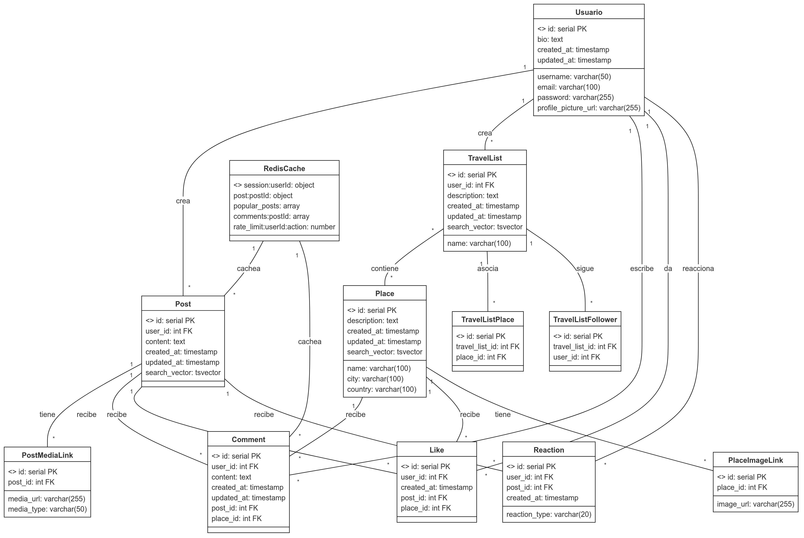

# Red Social de Viajes

Este proyecto es el backend de una red social orientada a compartir experiencias de viaje, utilizando Flask para la API, PostgreSQL como base de datos principal y Redis para caché, todo desplegado mediante Docker.

## 1. Descripción General

El sistema permite a los usuarios realizar publicaciones sobre viajes, interactuar con otros mediante comentarios, likes, y gestionar listas de destinos turísticos. Todo el backend está contenido en Docker para facilitar el despliegue y replicación.

El proyecto se basa en dos tecnologías principales de bases de datos:

- **PostgreSQL:** Para la gestión de todos los datos estructurados, incluyendo:
  - Usuarios y autenticación
  - Publicaciones y contenido
  - Lugares y destinos turísticos
  - Listas de viajes
  - Comentarios y reacciones
  - Interacciones sociales (likes, follows)

- **Redis:** Como sistema de caché para:
  - Optimizar la carga de publicaciones populares
  - Gestionar sesiones de usuario
  - Almacenar datos temporales
  - Implementar rate limiting
  - Mejorar el rendimiento general

## 2. Requisitos del Proyecto

### 2.1 Tecnologías Utilizadas

- **Flask para la API web:**
  ```bash
  pip install flask
  ```

- **PostgreSQL y su conector:**
  ```bash
  pip install psycopg2-binary
  ```

- **Redis para caché:**
  ```bash
  pip install redis
  ```

- **Gestión de JWT y variables de entorno:**
  ```bash
  pip install flask-jwt-extended python-dotenv
  ```

### 2.2 Dependencias de Desarrollo
- **Testing:**
  ```bash
  pip install pytest pytest-cov
  ```

### 2.3 Requisitos de Sistema
- Docker y Docker Compose
- Python 3.9+
- PostgreSQL 15.3+
- Redis 7.0.11+


## 3. Instrucciones de Instalación y Ejecución

### 3.1 Configuración Inicial

1. Clonar el repositorio:
   ```bash
   git clone https://github.com/LUISGM1501/DB_Proyecto1.git
   cd DB_Proyecto1
   ```

2. Configurar el entorno virtual:
   ```bash
   python -m venv venv
   source venv/bin/activate  # En Linux/MacOS
   venv\Scripts\activate     # En Windows
   ```

3. Instalar dependencias:
   ```bash
   pip install -r requirements.txt
   ```

### 3.2 Configuración del Entorno

Crear un archivo `.env` en la raíz del proyecto con las siguientes variables:
```env
DB_HOST_POSTGRES=postgres
DB_PORT_POSTGRES=5432
DB_USER=myuser
DB_PASSWORD=mypassword
JWT_SECRET_KEY=supersecretkey
REDIS_HOST=redis
REDIS_PORT=6379
```

### 3.3 Despliegue con Docker

1. Construir y levantar los contenedores:
   ```bash
   docker-compose up --build
   ```

2. Verificar que los servicios estén funcionando:
   ```bash
   docker-compose ps
   ```

3. Para detener los servicios:
   ```bash
   docker-compose down
   ```

### 3.4 Verificación de Servicios

1. PostgreSQL:
   ```bash
   docker exec -it db_proyecto1-postgres-1 psql -U myuser -d redsocial
   ```

2. Redis:
   ```bash
   docker exec -it db_proyecto1-redis-1 redis-cli ping
   ```

## 4. Estructura del Proyecto

```
DB_Proyecto1/
├── app.py                  # Punto de entrada de la aplicación
├── config/                 # Configuraciones
│   ├── __init__.py
│   └── database.py        # Configuración de bases de datos
├── controllers/           # Controladores
│   ├── user_controller.py
│   ├── post_controller.py
│   └── ...
├── models/               # Modelos de datos
│   ├── user.py
│   ├── post.py
│   └── ...
├── routes/              # Rutas de la API
│   ├── user_routes.py
│   ├── post_routes.py
│   └── ...
├── services/           # Servicios
│   ├── auth_service.py
│   └── cache_service.py
├── tests/             # Pruebas
│   ├── integration/
│   └── unit/
├── docker-compose.yml  # Configuración de Docker
└── requirements.txt    # Dependencias del proyecto
```

## 5. Base de Datos

### 5.1 Esquema PostgreSQL

El sistema utiliza una base de datos relacional PostgreSQL con las siguientes tablas principales:

#### Users
```sql
CREATE TABLE users (
    id SERIAL PRIMARY KEY,
    username VARCHAR(50) UNIQUE NOT NULL,
    email VARCHAR(100) UNIQUE NOT NULL,
    password VARCHAR(255) NOT NULL,
    bio TEXT,
    profile_picture_url VARCHAR(255),
    created_at TIMESTAMP WITH TIME ZONE DEFAULT CURRENT_TIMESTAMP,
    updated_at TIMESTAMP WITH TIME ZONE DEFAULT CURRENT_TIMESTAMP
);
```

#### Posts
```sql
CREATE TABLE posts (
    id SERIAL PRIMARY KEY,
    user_id INTEGER REFERENCES users(id) ON DELETE CASCADE,
    content TEXT NOT NULL,
    created_at TIMESTAMP WITH TIME ZONE DEFAULT CURRENT_TIMESTAMP,
    updated_at TIMESTAMP WITH TIME ZONE DEFAULT CURRENT_TIMESTAMP,
    search_vector tsvector
);
```

#### Places
```sql
CREATE TABLE places (
    id SERIAL PRIMARY KEY,
    name VARCHAR(100) NOT NULL,
    description TEXT,
    city VARCHAR(100) NOT NULL,
    country VARCHAR(100) NOT NULL,
    created_at TIMESTAMP WITH TIME ZONE DEFAULT CURRENT_TIMESTAMP,
    updated_at TIMESTAMP WITH TIME ZONE DEFAULT CURRENT_TIMESTAMP,
    search_vector tsvector
);
```


## 6. Sistema de Caché con Redis

### 6.1 Estructuras de Datos en Redis

#### Sesiones de Usuario
```
Key: "session:{user_id}"
Type: Hash
Fields:
- user_id: ID del usuario
- username: Nombre de usuario
- last_login: Último acceso
TTL: 3600 segundos (1 hora)
```

#### Posts Populares
```
Key: "popular_posts"
Type: Sorted Set
Score: Número de likes + comentarios
Members: IDs de posts
TTL: 300 segundos (5 minutos)
```

#### Rate Limiting
```
Key: "rate_limit:{user_id}"
Type: String (Counter)
TTL: 60 segundos
```

### 6.2 Ejemplos de Uso

```python
# Almacenar datos de sesión
redis_client.hset(f"session:{user_id}", 
    mapping={
        "user_id": user_id,
        "username": username,
        "last_login": datetime.now().isoformat()
    }
)
redis_client.expire(f"session:{user_id}", 3600)

# Actualizar posts populares
redis_client.zadd("popular_posts", {post_id: score})

# Rate limiting
requests = redis_client.incr(f"rate_limit:{user_id}")
redis_client.expire(f"rate_limit:{user_id}", 60)
```

## 7. Modelo de Datos

### 7.1 Diagrama Entidad-Relación



### 7.2 Relaciones Principales

1. **Usuario - Posts**
   - Un usuario puede crear múltiples posts
   - Cada post pertenece a un solo usuario

2. **Usuario - Places**
   - Los usuarios pueden crear y seguir lugares
   - Un lugar puede ser seguido por múltiples usuarios

3. **Usuario - TravelLists**
   - Un usuario puede crear múltiples listas de viaje
   - Cada lista pertenece a un usuario

4. **Posts - Comments**
   - Un post puede tener múltiples comentarios
   - Cada comentario pertenece a un post

5. **Places - TravelLists**
   - Un lugar puede estar en múltiples listas
   - Una lista puede contener múltiples lugares

### 7.3 Índices y Optimizaciones

#### PostgreSQL
```sql
-- Búsqueda de texto completo
CREATE INDEX posts_search_idx ON posts USING GIN (search_vector);
CREATE INDEX places_search_idx ON places USING GIN (search_vector);

-- Índices para relaciones frecuentes
CREATE INDEX idx_posts_user_id ON posts(user_id);
CREATE INDEX idx_comments_post_id ON comments(post_id);
CREATE INDEX idx_likes_post_id ON likes(post_id);
```

## 8. Documentación de la API

### 8.1 Autenticación

Todas las rutas (excepto login y registro) requieren un token JWT en el header:
```
Authorization: Bearer <token>
```

#### Endpoints de Autenticación

```http
POST /login
Content-Type: application/json

{
    "username": "string",
    "password": "string"
}

Response:
{
    "access_token": "string"
}
```

### 8.2 Usuarios

#### Crear Usuario
```http
POST /users
Content-Type: application/json

{
    "username": "string",
    "email": "string",
    "password": "string",
    "bio": "string",
    "profile_picture_url": "string"
}
```

#### Obtener Usuario
```http
GET /users/{user_id}

Response:
{
    "id": integer,
    "username": "string",
    "email": "string",
    "bio": "string",
    "profile_picture_url": "string"
}
```

### 8.3 Posts

#### Crear Post
```http
POST /posts
Content-Type: application/json

{
    "content": "string"
}

Response:
{
    "message": "Post created successfully",
    "post_id": integer
}
```

#### Obtener Posts
```http
GET /posts?page=1&page_size=10

Response:
{
    "posts": [
        {
            "id": integer,
            "content": "string",
            "user_id": integer,
            "created_at": "datetime",
            "updated_at": "datetime"
        }
    ],
    "total_count": integer,
    "page": integer,
    "page_size": integer
}
```

### 8.4 Lugares

#### Crear Lugar
```http
POST /places
Content-Type: application/json

{
    "name": "string",
    "description": "string",
    "city": "string",
    "country": "string"
}
```

#### Buscar Lugares
```http
GET /places/search?query=string&page=1&page_size=10

Response:
{
    "places": [
        {
            "id": integer,
            "name": "string",
            "description": "string",
            "city": "string",
            "country": "string"
        }
    ],
    "total": integer
}
```

## 9. Testing

### 9.1 Configuración de Pruebas

El proyecto utiliza pytest para las pruebas unitarias e integración. La configuración se encuentra en `pytest.ini`:

```ini
[pytest]
pythonpath = .
testpaths = tests
python_files = test_*.py
python_classes = Test*
python_functions = test_*

markers =
    unit: Unit tests
    integration: Integration tests
    api: API tests

addopts = 
    --verbose
    --tb=short
    --cov=.
    --cov-report=html
    --cov-report=term-missing
    --cov-fail-under=85
    --no-cov-on-fail
```

### 9.2 Ejecutar Pruebas

```bash
# Ejecutar todas las pruebas
pytest tests/

# Ejecutar pruebas con cobertura
pytest --cov=tests tests/

# Ejecutar pruebas específicas
pytest tests/unit/
pytest tests/integration/

# Ejecutar una prueba específica
pytest tests/unit/test_user_controller.py -v
```

### 9.3 Estructura de Pruebas

```
tests/
├── integration/
│   ├── test_user_routes.py
│   ├── test_post_routes.py
│   └── test_place_routes.py
└── unit/
    ├── test_user_controller.py
    ├── test_post_controller.py
    └── test_place_controller.py
```

## 10. Despliegue y CI/CD

### 10.1 Pipeline de GitHub Actions

```yaml
name: CI/CD Pipeline

on:
  push:
    branches: [ main ]
  pull_request:
    branches: [ main ]

jobs:
  test:
    runs-on: ubuntu-latest
    
    services:
      postgres:
        image: postgres:15.3
        env:
          POSTGRES_USER: myuser
          POSTGRES_PASSWORD: mypassword
          POSTGRES_DB: redsocial
        ports:
          - 5432:5432
        options: >-
          --health-cmd pg_isready
          --health-interval 10s
          --health-timeout 5s
          --health-retries 5
      
      redis:
        image: redis:7.0.11
        ports:
          - 6379:6379
        options: >-
          --health-cmd "redis-cli ping"
          --health-interval 10s
          --health-timeout 5s
          --health-retries 5

    steps:
    - uses: actions/checkout@v2
    - name: Set up Python
      uses: actions/setup-python@v2
      with:
        python-version: '3.9'
    
    - name: Install dependencies
      run: |
        python -m pip install --upgrade pip
        pip install -r requirements.txt
    
    - name: Run tests
      run: |
        pytest --cov=.
```

### 10.2 Gestión de Secretos

Las variables sensibles se manejan a través de secretos de GitHub:

- `DB_PASSWORD`
- `JWT_SECRET`
- `REDIS_PASSWORD`

### 10.3 Monitoreo

Se recomienda implementar monitoreo usando herramientas como:

- Prometheus para métricas
- Grafana para visualización
- ELK Stack para logs

## 11. Consideraciones de Seguridad

1. **Autenticación y Autorización**
   - JWT para autenticación
   - Rate limiting por usuario
   - Sesiones invalidadas automáticamente

2. **Bases de Datos**
   - Conexiones seguras a PostgreSQL
   - Contraseñas hasheadas
   - Prepared statements para prevenir SQL injection

3. **API**
   - Validación de entrada
   - Sanitización de datos
   - CORS configurado apropiadamente


# Crear un ambiente conda nuevo
conda create -n db_proyecto1 python=3.9 -y

# Activar el ambiente conda
conda activate db_proyecto1

# Instalar las dependencias usando conda
conda install -c conda-forge flask werkzeug psycopg2 pymongo redis-py python-dotenv -y

# Instalar las dependencias de testing con conda
conda install -c conda-forge pytest pytest-cov pytz -y

# Solo las que no estén en conda, instalar con pip
pip install flask-jwt-extended mongomock fakeredis pytest-mock

